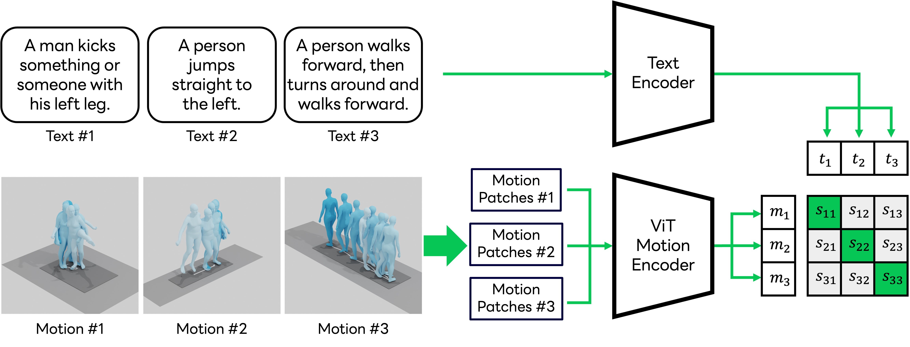

# Motion Patches

Code of the paper "Exploring Vision Transformers for 3D Human Motion-Language Models with Motion Patches" (CVPR 2024).

[](https://arxiv.org/pdf/2405.04771)
<a href='https://yu1ut.com/MotionPatches-HP/'></a>
[](https://creativecommons.org/licenses/by-nc/4.0/)


## Framework



## Requirements
- Python 3.11
- PyTorch 2.0.1+

#### Using [Poetry](https://python-poetry.org/docs/) (Recommended)
```bash
poetry install
```

#### Using Conda
```bash
conda create -n MoPa python=3.11
conda activate MoPa
conda install pytorch==2.0.1 torchvision==0.15.2 torchaudio==2.0.2 pytorch-cuda=11.8 -c pytorch -c nvidia
pip install -r requirements.txt
```

## Data Preparation
Download HumanML3D Dataset and KIT-ML Dataset from the repository of [HumanML3D](https://github.com/EricGuo5513/HumanML3D#humanml3d-3d-human-motion-language-dataset). Unzip and locate them in the `data` folder.

The whole directory should be look like this:
```
MotionPatches
│   README.md
│   requirements.txt
|   ...
|
└───conf
└───scripts
└───...
│   
└───data
    └───HumanML3D
    |   └───new_joint_vecs
    |   └───new_joints
    |   └───...
    │   
    └───KIT-ML
        └───new_joint_vecs
        └───new_joints
        └───...
```
Then calculate the mean and variance of each dataset by:
```bash
python scripts/cal_mean_var.py
```

## Pre-trained Model
Download pre-trained model from [huggingface](https://huggingface.co/line-corporation/MotionPatches) and put them in `checkpoints/pretrained/`.

Evaluate the model with HumanML3D via retrieval:
```bash
python scripts/test.py dataset=HumanML3D exp_name=pretrained
```

Evaluate the model with KIT-ML via retrieval:
```bash
python scripts/test.py dataset=KIT-ML exp_name=pretrained
```

## Training
Train the model with HumanML3D:
```bash
python scripts/train.py dataset=HumanML3D
```

Train the model with KIT-ML:
```bash
python scripts/train.py dataset=KIT-ML
```

## Evaluation
Evaluate the model with HumanML3D via retrieval:
```bash
python scripts/test.py dataset=HumanML3D
```

Evaluate the model with KIT-ML via retrieval:
```bash
python scripts/test.py dataset=KIT-ML
```

## Citation

```
@InProceedings{yu2024exploring,
  title={Exploring Vision Transformers for 3D Human Motion-Language Models with Motion Patches},
  author={Yu, Qing and Tanaka, Mikihiro and Fujiwara, Kent},
  booktitle={Proceedings of the IEEE/CVF Conference on Computer Vision and Pattern Recognition},
  year={2024}
}
```

## License
[CC BY-NC 4.0](LICENSE)

Additionally, this repository contains third-party software. Refer [NOTICE.txt](NOTICE.txt) for more details and follow the terms and conditions of their use.